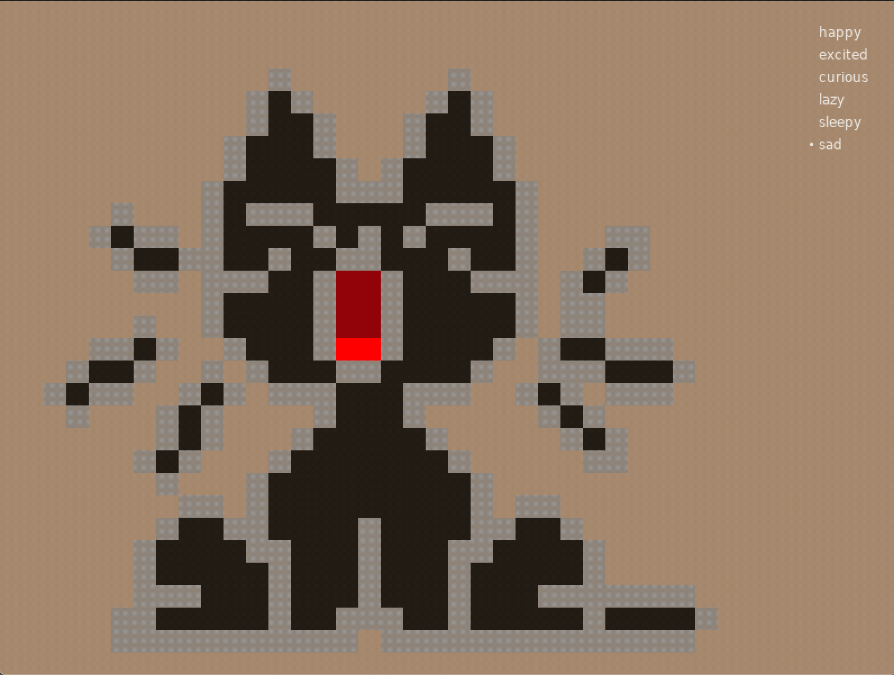

# pakemon-personalitybuilder

This will allow you to quickly build a personality plugin for [Pakémon](https://github.com/notnullgames//pakemon).

For now it's basic hacked-together tools we use ourselves, but eventually it will include more tools & info.

You can open a simple sprite-animation builder, [here](https://notnullgames.github.io/pakemon-personalitybuilder/).

You can run a nice browser for emotions:

```
love .
```

It hot-reloads, so you can play with frames and animations, on the fly.

